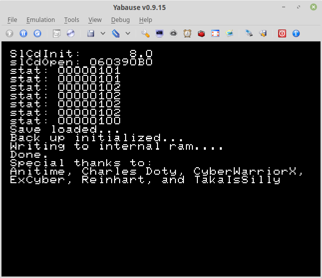

# Fire Pro Wrestling Save Game Copier
A utility I wrote to copy a save game file for Fire Pro Wrestling: 6 Man Scramble from the CD to the Sega Saturn's internal memory. Written in ~2002, I believe this was the first Saturn utility to copy a save game file from a CD. 

